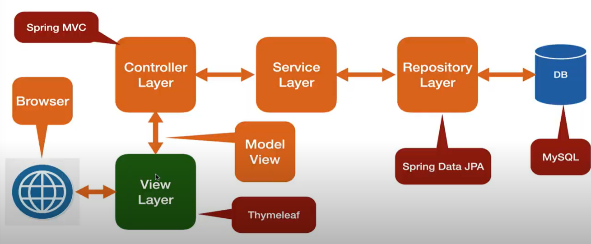
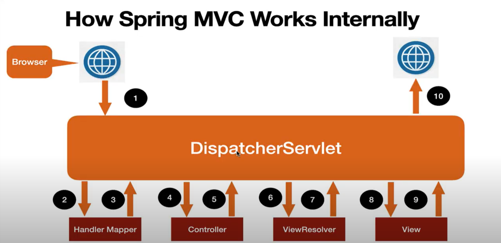
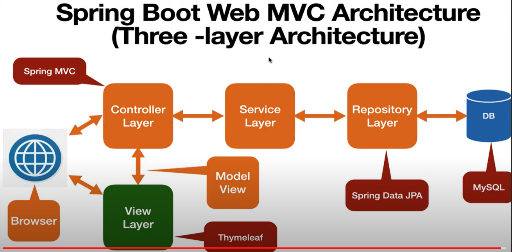

# Getting Started

## What is Spring MVC
1. Spring MVC is a popular module in Spring Framework and it is used to develop web applications as well as RESTful 
web services.
2. Spring MVC is called web framework because it provides all required components to develop a complete web application.
3. The Spring MVC framework provides Model-View-Controller (MVC) architecture and ready components that can be used 
to develop flexible and loosely coupled web applications

## What is Spring MVC
- **Spring MVC**: Spring MVC is a poplar module in Spring Framework and it is uused to develop web applications as well as
RESTful web services.
- Spring webflow
- Spring Security
- Spring Integration
- Spring Web Services
- Spring Data
- Spring Batch
- Spring Social

## What is Spring MVC
The MVC pattern results in separating the different aspects of the application while providing a loose coupling between
these elements.

1. The Model encapsulates the application data and in general they will consist of POJO.
2. The View is responsible for rendering the model data and in general it generates HTML output that the client's browser
can interest.
3. The Controller is responsible for processing user requests and building an appropriate model and passes it to the view 
for rendering.

## Spring Boot Web MVC Architecture

## What is Spring MVC
1. The Spring MVC (model-view-controller) framework is designed around a **DispatcherServlet** that handles all the
HTTP requests and response.
2. In Spring Web MVC, the DispatcherServlet class works as the **front controller**. It is responsible to manage the
flow of the spring MVC application.

## What is DispatcherServlet
1. In Spring Web MVC, the DispatcherServlet class works as the **front controller** and it is responsible to manage 
the HTTP request flow of the Spring MVC application.
2. A **Front Controller** is a common pattern in web applications and is used to receive requests and delegate to other 
components in the application for actual processing. The **DispatcherServlet** is a front controller like it provides 
a single entry point for a client request to Spring MVC web application and forwards request to Spring MVC 
controllers for processing.
3. DispatcherServlet is a actual Servlet and we can configure in web.xml or using 
**AbstractAnnotationConfigDispatcherServletInitializer**
4. Spring Boot provides the spring-boot-starter-web library for developing web application using spring MVC. One of the
main feature of Spring Boot is autoconfiguration. The Spring Boot autoconfiguration registers and configures the 
**DispatcherServlet** automatically. Therefore, we don't need to register the **DispatcherServlet** manually.

## Spring MVC Components
1. DispatcherServlet
2. Controller
3. Handler method
4. ViewResolver
5. view
6. Model

## What is Controller
1. Controller is Spring MVC web application is a component that handles incoming HTTP requests
2. Spring provide @Controller annotation to make a Java class as a Spring MVC controller. The @Controller annotation
indicates that a particular class serves tha role of a controller.
3. We will define handler methods within Controller.

## What is Handler Method
1. Handler method is a method annotated with @RequestMapping annotation (GetMapping and PostMapping) capable to handle
incoming HTTP request.
2. We define Handler method in Controller.
3. Handler method process the HTTP request and return model and view.

## What is ViewResolver
1. **ViewResolver** responsible to map logical view with actual view and return the actual view details back to the **DispatcherServlet**.
2. Spring Boot auto configures **ViewResolver** for Thymeleaf so we don't have to manually configure **ViewResolver** for
Thymeleaf.

## What is View
1. The View component merge view and model and forms a plain HTML output. Finally, the view component sends HTML output
back to the DispatcherServlet.
2. DispatcherServlet send HTML output in response to display in a browser.

## What is Model
1. The Model encapsulates the application data and in general they will consist of POJO.

## How Spring MVC Works Internally

- **Step 1** - When the client (browser) sends an HTTP request to a specific URL. The DispatcherServlet of Spring MVC
receives the request.
- **Step 2** - DispatcherServlet consult to HandlerMapper to identify which controller is responsible to handle the 
HTTP request.
- **Step 3** - HandleMapper selects the controller which is mapped to the incoming request URL and return the
(selected Handler) and Controller details to DispatcherServlet.
- **Step 4** - Now DispatcherServlet knows which controller is responsible to process the request so DispatcherServlet
will forward that request to the corresponding controller to process the request.
- **Step 5** - Now the controller process the request, validates the request, and creates a model with data. Finally,
the controller returns the logical name of view and model to the DispatcherServlet.
- **Step 6** - DispatcherServlet consult ViewResolver to resolve a logical view with the physical view that exists
in the application.
- **Step 7** - ViewResolver responsible to map logical view with actual view and return the actual view details back
to the DispatcherServlet.
- **Step 8** - Now DispatcherServlet sends the view and model to the view component.
- **Step 9** - The View component merge view and model and forms a plain HTMl output. Finally, the View component sends
HTML output back to the DispatcherServlet.
- **Step 10** - The DispatcherServlet Finally sends HTML output as a response back to the browser for rendering.

## Spring Boot Web MVC Architecture (Three-layer Architecture)
